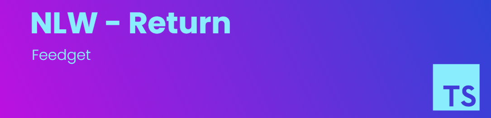

  

  <a href="#-tecnologias">Tecnologias</a>&nbsp;&nbsp;&nbsp;|&nbsp;&nbsp;&nbsp;
  <a href="#-projeto">Projeto</a>&nbsp;&nbsp;&nbsp;

## 💻 Projeto

O projeto desenvolvido é uma aplicação para coleta de feedbacks que pode ser adicionado em qualquer ambiente mobile ou web.

Este é um projeto desenvolvido durante a Next Level Week, apresentado pela **[Rocketseat](https://www.rocketseat.com.br)**.

## 🎯 Funcionalidades

- ✔️ Envio de feedbacks
- ✔️ Screenshot com html2canvas
- ✔️ Uso do MailTrap para o envio de e-mails com os feedbacks

## 🧪 Tecnologias

Esse projeto foi desenvolvido com as seguintes tecnologias:

- [Node.js](https://nodejs.org)
- [React](https://reactjs.org)
- [Tailwindcss](https://tailwindcss.com)
- [Vite](https://vitejs.dev)
- [TypeScript](https://www.typescriptlang.org)
- [Express](https://expressjs.com)
- [Prisma](https://www.prisma.io)
- [PostgreSQL](https://www.postgresql.org)
- [Jest](https://jestjs.io)
